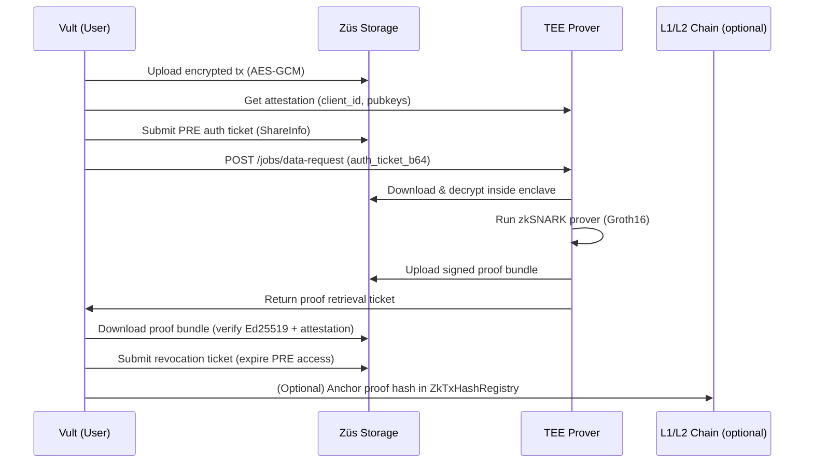
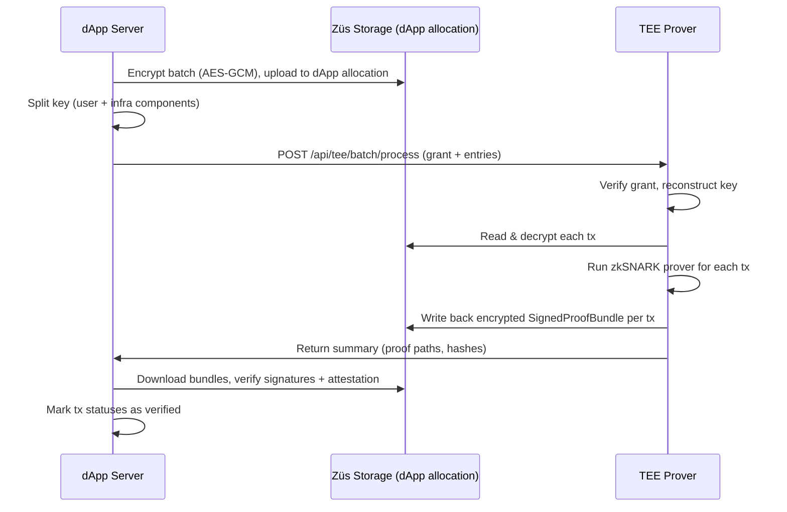

## Züs TEE‑ZK Prover + Vult – Architectural Overview

This document walks through how our **ZK Prover** works with **Vult** to enable **private transactions** on any chain.  

---

## 1. Components at a Glance

- **Vult (user wallet / app)**  
  - Where the user lives: mobile / desktop / browser.  
  - Holds user keys, talks to Züs storage, the TEE, and L1/L2 chains.  
  - Uses the `user-client` SDK under the hood (`transaction-orchestrator`, `TEEClient`, `X402Client`, etc.).

- **TEE Server (“Prover”)**  
  - Our prover backend, running inside a Trusted Execution Environment.  
  - Fetches encrypted data from Züs, decrypts **only inside the enclave**, runs zkSNARK circuits, signs the result, and writes proofs back to storage.
  - When built with `-tags=gnark`, it runs **Groth16 over BN254** using gnark.

- **dApp / Batch Server**  
  - Backend for dApp‑driven flows and batch processing.  
  - Encrypts batches of transactions, manages **split‑keys**, uploads encrypted blobs to Züs, and calls the TEE batch API.

- **Züs Storage**  
  - Decentralized storage network used for all payloads and proof artifacts.  
  - Access is controlled via **auth tickets** (Flow 1) and **split‑keys + grants** (Flow 2).

- **L1/L2 Chains (e.g. Base Sepolia)**  
  - Where we **anchor proofs** and, eventually, verify proofs on‑chain.  
  - Current contracts:
    - `TxHashVerifier.sol` – Groth16 verifier for our `txHashCircuit`.  
    - `ZkTxHashRegistry.sol` – simple registry of `(jobIdHash, proofHash)`.  
    - `TxProofRegistry.sol` – wrapper that verifies a proof via `TxHashVerifier` and then records its hash in `ZkTxHashRegistry`.

---

## 2. Flow 1 – Individual User Flow (PRE)

Flow 1 is the “single user, single transaction” journey. The mental model is:

> “Encrypt on the client, share *only* with the TEE, let the TEE prove correctness, then revoke access.”

### 2.1. High‑Level Sequence

### 2.2. What Actually Happens (Implementation View)

**Step 1 – Encrypt & upload**

- Vult builds a JSON transaction, e.g.:
  - `{ op: "transfer", payload: { amount: "1.0", to: "alice" }, timestamp: ... }`
- `EncryptionService`:
  - Generates a 32‑byte AES‑256 key.  
  - Encrypts the JSON with AES‑GCM → `{ iv_b64, tag_b64, ciphertext_b64 }`.
- `AllocationManager`:
  - Creates an immutable allocation on Züs via `zbox`.  
  - Uploads the encrypted JSON as `/tx.<timestamp>.json`.

**Step 2 – PRE: granting the TEE temporary access**

- Vult calls `TEEClient.getAttestation()`:
  - Gets `client_id`, an Ed25519 signing key, and a Curve25519 encryption key.  
  - Attestation is checked for freshness and bound later to proof metadata.
- Using `ProxyReEncryption`:
  - Vult derives a **re‑encryption key** from its own key and the TEE’s encryption key.
- Vult constructs an **AuthTicket**:
  - Includes allocation ID, file path, hash of the encrypted payload, TEE client ID, PRE key, and an expiration time.
  - Signs and **submits it to blobbers** via `zbox share` or a manual ShareInfo flow.

At this point, blobbers know:
> “For this file, until this timestamp, this TEE may re‑encrypt and download the ciphertext.”

**Step 3 – TEE downloads, decrypts, and proves**

- Vult calls `TEEClient.sendAuthTicket(authTicketB64)`:
  - TEE enqueues a job and returns a `jobId`.
  - Vult polls `TEEClient.pollJob(jobId)` until the job reaches `completed` or `failed`.
- On the TEE side:
  - Orchestrator (`ProofOrchestrator`) uses the auth ticket to ask Züs for the file.  
  - Blobbers re‑encrypt the ciphertext so only the TEE’s key can decrypt it.  
  - Inside the enclave:
    - The TEE decrypts the blob.  
    - Parses the transaction JSON.  
    - Computes a transaction hash `tx.Hash = sha256(JSON)`.  
    - Calls the prover service (`prover.Service.GenerateProof`):
      - On gnark builds (`-tags=gnark`), this invokes `gnarkCircuitProver` with our `txHashCircuit`.
      - Produces a **real Groth16 proof** on BN254, plus:
        - `circuit_id`,
        - `proof_type = "groth16"`,
        - `verifier_key_id = "txhash_bn254_v1"`.

**Step 4 – Signed proof bundle & upload**

- The TEE builds `TEEMetadata`:
  - Includes server ID, version, attestation blob, and timestamp.
- It then creates a **canonical payload**:
  - `{ proof: ProofOutput, tee_metadata: TEEMetadata }`,
  - Hashes it with SHA‑256 and signs the hash with its **Ed25519** key.  
- The final format is `SignedProofBundle`:

  - `proof`: proof data + public signals + circuit info.  
  - `tee_metadata`: TEE identity and attestation.  
  - `signature`: Ed25519 over the payload hash.

- The bundle is AES‑GCM encrypted and stored in a **TEE‑owned allocation** on Züs.  
- The TEE issues a **new auth ticket** so the user can download the proof bundle.

**Step 5 – User verification & revocation**

- Vult calls `TEEClient.getProofRetrievalTicket(jobId)` and then uses zbox/HTTP to:
  - Download the bundle from Züs or directly from the TEE.  
  - Recompute the payload hash and verify:
    - Hash matches `signature.payload_hash_hex`.  
    - Ed25519 signature is valid for the TEE public key from attestation.  
    - Attestation is present and fresh enough.
- After verification, Vult:
  - Sends a **revocation ShareInfo** with an already‑expired timestamp.  
  - This closes the window during which the TEE can access that file.

**Optional: L1 anchoring**

- The Flow 1 SDK (`runFlow1AndRecordOnL1WithEnv`) already:
  - Takes `sha256(proofBytes)` as `proofHashHex`,
  - Calls `ZkTxHashRegistry.submitProofHash(jobIdHash, proofHash)` on L1 (e.g. Base Sepolia),
  - Returns L1 transaction hashes per chain.

---

## 3. Flow 2 – dApp / Batch Flow (Split‑Key)

Flow 2 is designed for dApps or services that want to process **batches of user transactions** privately, with limited‑time access to a dApp‑owned Züs allocation.

### 3.1. High‑Level Sequence

### 3.2. Encrypt & Delegate (dApp side)

1. The dApp prepares a list of transactions:
   - Each tx is a small JSON payload, e.g. `{ op: "transfer", amount: "10", to: "user-123", nonce: 0 }`.

2. The dApp server’s `Uploader`:
   - Calls the split‑key manager to **create a batch key** (or reuse one for the batch).  
   - Encrypts each tx with AES‑GCM and writes it to the **dApp allocation** via GoSDK.  
   - Records:
     - The remote path (`batches/<batchId>/tx-0.enc`, etc.).  
     - The ciphertext (as base64) for convenience.

3. The split‑key manager:
   - Maintains:
     - A **user component** of the key (stored alongside batch metadata).  
     - An **infra component** stored in a zAuth‑style service.  
   - Issues a signed `Grant` (HMAC‑SHA256) that says:
     - “Key `<KeyID>` for allocation `<AllocationID>` can be used for `batch:process` until `<ExpiresAt>`.”

4. The dApp calls the TEE batch API:
   - `POST /api/tee/batch/process` with:
     - `batch_id`, `allocation_id`, `key_id`, `master_key_b64`.  
     - The **signed grant**.  
     - The entries, each with `tx_id` and either `ciphertext_b64` or a remote path.

### 3.3. TEE: Batch Prove & Write Back

On the TEE side, `handleBatchProcess` does the following:

1. **Grant verification**  
   - Checks:
     - Signature (HMAC with shared secret).  
     - `allocation_id` + `key_id` match.  
     - Permissions include `batch:process`.  
     - Not expired.

2. **Per‑entry processing**  
   For each batch entry:
   - Decrypts the ciphertext (AES‑GCM with the batch key).  
   - Computes a transaction hash.  
   - Uses `prover.Service.GenerateProof` to run the same **Groth16** circuit as Flow 1.
   - Builds a `SignedProofBundle` exactly like in Flow 1
     - (ProofOutput + TEEMetadata + Ed25519 signature).
   - Encrypts the bundle again with AES‑GCM and writes it back to **the same dApp allocation**, under a `.proof` path.

3. **Response to dApp**  
   - Returns a concise list of:
     - `tx_id`, `proof_path`, and `hash_hex` per transaction.

### 3.4. dApp: Verify & Mark Verified

The dApp server:

1. Reconstructs the batch key again.  
2. Downloads each encrypted bundle from the dApp allocation.  
3. Decrypts and verifies:
   - Payload hash, Ed25519 signature, attestation presence.  
4. If everything checks out:
   - Writes those encrypted bundles back to its own allocation (for auditability).  
   - Sets:
     - Per‑tx status to **`verified`**.  
     - Batch status to **`completed`**.

An optional monitor can then:
- Watch for `completed` batches and drive **L1 settlement** (anchoring or full proof verification).

---

## 4. Attestation & Trust Model

- The TEE exposes `/attestation`:
  - Carries a TEE identity (`client_id`) and public keys. 

- Every proof bundle includes:
  - **TEEMetadata**, which includes:
    - The TEE server ID and version.  
    - Attestation package (quote, cert chain, PCRs, etc.).  
  - **TEESignature**, an Ed25519 signature over a canonical JSON payload.

- Clients (Vult / dApp) enforce:
  - Correct payload hash.  
  - Valid signature.  
  - Attestation presence (and, for production, would validate the quote chain).

The result is a chain of trust:
> L1 anchoring → proof hash → signed proof bundle → TEEMetadata → attestation → enclave identity.

---

## 5. L1/L2 Anchoring and On‑Chain Verification

We separate **off‑chain proving** from **on‑chain anchoring**:

- For Flow 1:
  - `runFlow1AndRecordOnL1WithEnv` (SDK) runs Flow 1, then:
    - Computes `sha256(proofBytes)` as `proofHashHex`.  
    - For each configured chain, calls `ZkTxHashRegistry.submitProofHash(jobIdHash, proofHash)`.  
  - This gives us:
    - One off‑chain job per transaction.
    - One or more L1 transactions that record proof hashes.

- For Flow 2:
  - `runFlow2AndRecordOnL1WithEnv`:
    - Runs the full batch flow.  
    - Computes a **batch hash** from `{ batchId, status, txStatus, proofs }`.  
    - Anchors that batch hash on each configured chain via the same registry.  
    - Cancels the batch (`/batch/cancel/:batchId`) so split‑keys are revoked after settlement.

For deeper integration, `TxProofRegistry` can be used to:
- Accept full Groth16 proofs (`uint256[8]` arrays).  
- Call `TxHashVerifier.verifyProof(proof, [txHash])`.  
- Only if the pairing check passes, forward `(jobIdHash, proofHash)` to `ZkTxHashRegistry`.

This lets us gradually evolve from “hash anchoring” to **full on‑chain proof verification** without changing the off‑chain prover.

---

## 6. How This Feels in Vult

From a user’s perspective, Vult aims to keep all of this complexity hidden:

- When the user hits **“Send (Private)”**:
  - Vult encrypts the tx and uploads it to Züs.  
  - Vult negotiates attestation and PRE with the TEE.  
  - The TEE privately proves the statement and returns a signed proof bundle.  
  - Vult revokes sharing and can optionally anchor the proof hash on L1.

- For power users and integrators:
  - The SDK exposes structured results:
    - `jobId`, `proofHashHex`, `l1TxHashes`, tx statuses, etc.  
  - They can plug these into monitoring dashboards, explorers, or compliance tools.

Under the hood, everything is:
- **Encrypted at rest** on Züs.  
- **Decrypted only in the enclave**.  
- **Proven with real zkSNARKs**.  
- **Signed and attestable**.  
- **Optionally anchored on L1** for long‑term verifiability.

