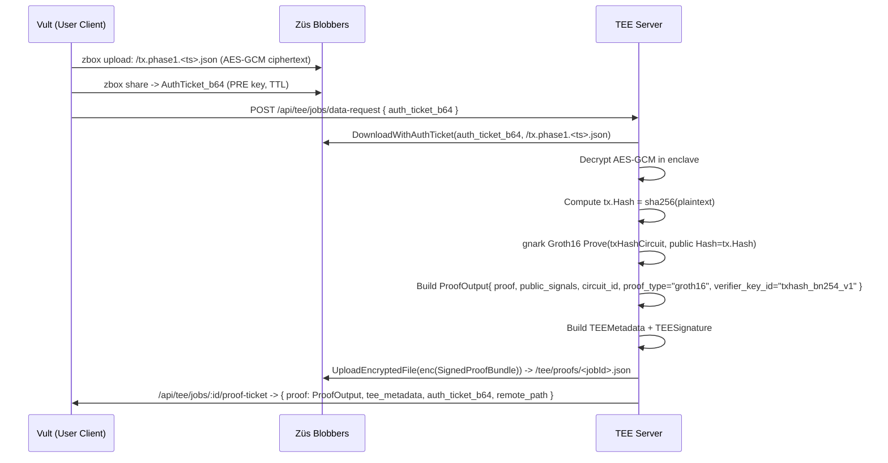

# Züs ZK Prover


---

## 1. Goals & High‑Level Concept

Our Züs TEE–ZK Prover is a privacy and integrity layer for any wallet or dApp that wants to execute **private, verifiable transactions** on public blockchains (L1/L2) using **Züs storage + TEEs + zkSNARKs**.

At a high level:

- Users (via **Vult** mobile/desktop/browser) or dApps send **encrypted transactions** to Züs.
- A **TEE server** running inside a hardware enclave pulls those encrypted transactions from Züs, **decrypts them in‑enclave**, and runs a **zero‑knowledge circuit** (Groth16 on BN254 via gnark) that proves a statement about the transaction (Phase 1: "this proof is bound to this transaction hash").
- The TEE returns a **signed proof bundle** + attestation. For Flow 1 (user) this bundle is written to a dedicated TEE allocation; for Flow 2 (dApp/batch) the bundle is written back into the **dApp’s own Züs allocation** under a split key.
- The **user or dApp** verifies the proof bundle and can then:
  - Submit a transaction to an L1/L2 (Ethereum/Base etc.) that carries the proof.
  - Or, in Phase 1, anchor the proof hash on L1 via the `ZkTxHashRegistry`/`TxProofRegistry` contracts on Base Sepolia.
- **x402** sits in front of TEE and dApp endpoints, allowing us to gate access on cryptographic micropayments (USDC/ADA/NIGHT via facilitator).
- **Key & data lifecycles** (PRE auth tickets, split-keys, allocations) are designed so that the TEE’s access window is narrowly bounded and revocable, limiting blast radius in case of any compromise.

---

## 2. Components & Deployment Topology

### 2.1 Major Components

- **Vult Clients (mobile / desktop / browser)**
  - User‑facing apps that initiate private transfers, view proofs, share encrypted history, and manage x402 payments.
  - Built on top of the `user-client` SDK (TypeScript).

- **User‑Client SDK (`user-client/`)**
  - `transaction-orchestrator.ts`: orchestrates Flow 1 (PRE‑based private transaction) from a wallet’s perspective.
  - `tee-client.ts`: HTTP client for the TEE server, including x402 handling and signature verification.
  - `x402-client.ts`: x402 payment client that parses `402 Payment Required` responses, talks to a facilitator, and attaches `X-Payment-*` headers.
  - `l1-registry-client.ts`: thin ethers.js client for L1 registries (e.g. `ZkTxHashRegistry` on Base/Ethereum).
  - `sdk.ts`: high‑level orchestration helpers (`runFlow1WithEnv`, `runFlow1AndRecordOnL1WithEnv`, `runFlow2AndRecordOnL1WithEnv`).

- **TEE Server (`tee-server/`)**
  - **API layer** (`internal/api/handlers.go`, `internal/api/orchestrator.go`, `internal/api/batch_handler.go`):
    - `/attestation`: returns the enclave’s attestation bundle plus TEE public keys.
    - `/api/tee/jobs/data-request`: Flow 1 asynchronous proving via auth tickets.
    - `/api/tee/jobs/:id`: job status polling.
    - `/api/tee/jobs/:id/proof-ticket`: returns signed proof bundle & retrieval ticket.
    - `/api/tee/prove`: synchronous Flow 1 proving endpoint.
    - `/api/tee/batch/process`: Flow 2 batch proving under split‑keys.
  - **Prover (`internal/prover/`)**:
    - `circuit_gnark.go`: `txHashCircuit` (Groth16 on BN254) + `gnarkCircuitProver`.
    - `prover.go`: `Service.GenerateProof` that uses gnark when built with `-tags=gnark`, otherwise falls back to a deterministic mock (dev‑only).
  - **Storage (`internal/storage/`)**:
    - Downloads encrypted txs from Züs (user allocations) via zbox/GoSDK.
    - Uploads encrypted proof bundles to TEE allocations via GoSDK + zbox fallback.
  - **Attestation (`internal/attestation/`)**:
    - Constructs `TEEMetadata` with `server_id`, `client_id`, `MREnclave`, `TEEAttestationPackage`, etc.
  - **x402 Paywall (`internal/payments/x402/`)**:
    - Wraps sensitive endpoints with `Paywall.Require`, which returns HTTP 402 + x402 instructions unless a valid `X-Payment-ID`/`X-Payment-Token` is present (or `X402_DEV_BYPASS` with `dev-*` IDs in dev).

- **dApp Server (`dapp-server/`)**
  - **API (`internal/api/handlers.go`)**:
    - `/batch/submit`: Flow 2 batch submission with `allocation_id`, `transactions[]`, `key_ttl_seconds`, `user_id`.
    - `/batch/status/:batchId`, `/batch/results/:batchId`, `/batch/cancel/:batchId`, `/transactions/:txId`.
  - **Batch Uploader (`internal/batch/uploader.go`)**:
    - Generates a symmetric key via `splitkey.Manager`.
    - Encrypts each tx with AES‑GCM and uploads to the (real) dApp Züs allocation via GoSDK + zbox fallback.
    - Grants the TEE temporary access to the key via `GrantTeeAccess` (split‑key infra), automatically revoked via `RevokeAllForKey` when the batch finishes.
  - **Split-Key Infra (`internal/splitkey/`)**:
    - `Manager`: creates per‑batch keys and issues HMAC‑signed `Grant` objects (`key_id`, `allocation_id`, `expires_at`, `permissions`, `signature_b64`).
    - `zauth_hmac.go`: `HMACGrantVerifier` calculates HMAC‑SHA256 over {key_id, allocation_id, expires_at, permissions}.
  - **x402 Paywall (`internal/payments/x402/`)**:
    - `Paywall.Require` protects `/batch/submit`, returning x402 JSON + `X-Payment-*` headers when payment is required.

- **Züs Network**
  - **Blobbers**: store encrypted tx and proof blobs under allocations (`user_alloc`, `dapp_alloc`, `tee_alloc`) with consensus guarantees.
  - **GoSDK & zbox**: our libraries/CLI to create allocations, upload/download, and mint/preauth tickets.

- **L1 / L2 Contracts (Base Sepolia demo)**
  - `TxHashVerifier` (`contracts/TxHashVerifier.sol`, deployed):
    - Groth16 verifier contract for the `txHashCircuit` (BN254); takes `uint256[8] proof, uint256[1] input`.
  - `ZkTxHashRegistry` (`contracts/ZkTxHashRegistry.sol`, deployed):
    - Simple `submitProofHash(bytes32 jobIdHash, bytes32 proofHash)` + `ProofInvalid` event; used for anchoring proofs (Flow 1) and batch hashes (Flow 2).
  - `TxProofRegistry` (`contracts/TxProofRegistry.sol`, deployed):
    - Calls `TxHashVerifier.verifyProof` with `(proof, [txHash])`.
    - On success, calls `ZkTxHashRegistry.submitProofHash(jobIdHash, proofHash)` and emits `TxProofVerifiedAndRecorded`.

---

## 3. Flow 1 – Private User Transaction (PRE + TEE + ZK)

### 3.1 Actors & Roles

- **User (via Vult)**: wants to send a private transaction (e.g. transfer 1 USDC to another address) and receive a ZK proof of correct behavior.
- **User‑Client SDK**: runs in Vult (browser/mobile/electron) and speaks to Züs (zbox/GoSDK) and the TEE server.
- **TEE Server**: runs inside a secure enclave (mock‑SGX in dev; Nitro/SGX in production), holds a private decryption key and zkSNARK proving key.
- **L1 Wallet / Tx Submitter**: sends the final on-chain transaction with proof or calls `TxProofRegistry`/`ZkTxHashRegistry`.

### 3.2 Step‑by‑Step Walkthrough

1. **User creates a private transaction in Vult**
   - User enters:
     - `amount` (e.g. `1.0`),
     - `to` (recipient address or identifier),
     - optional memo.
   - Vult calls `transaction-orchestrator`’s `runFlow1`:

   ```ts
   const orchestrator = new TransactionOrchestrator(wallet);
   const res = await orchestrator.runFlow1({ transaction, blobberUrls });
   // res: { jobId, allocationId, proofHashHex, ... }
   ```

2. **Encrypt & upload via Züs (PRE)**
   - `runFlow1`:
     - Generates a 256‑bit AES‑GCM key with `EncryptionService.generateKey()`.
     - Serializes the tx JSON and encrypts it with `encryptBufferAesGcm`.
     - Calls `zbox newallocation` (if needed) to create a **user allocation** (`~/.zcn/user_alloc.txt`) on Züs devnet.
     - Uses `zbox upload` to store `tx.phase1.<timestamp>.json` (the encrypted tx) into the user’s allocation.

3. **AuthTicket & PRE sharing**
   - From the user’s Curve25519 key pair and the TEE’s Curve25519 public key (delivered via `/attestation`), `ProxyReEncryption`:
     - Derives a **re‑encryption key** `reKeyB64`.
     - Calls `zbox share --encryptionpublickey <TEE_curve25519_pub>` to create an **auth ticket** that:
       - Grants the TEE read access to `/tx.phase1...json` in the user’s allocation.
       - Embeds an expiry time (e.g. 3600 seconds).
       - Optionally includes `fileContentHash`, `client_id`, etc.
   - If `zbox share` fails (e.g. CLI output format changed), we fall back to constructing and signing the ticket client‑side using `ProxyReEncryption.buildAuthTicket` + `.signAuthTicket`.

4. **Submit job to the TEE**
   - `TEEClient.sendAuthTicket(authTicketB64)`:

```ts
const jobId = await tee.sendAuthTicket(authTicketB64);
// internally:
// POST /api/tee/jobs/data-request { auth_ticket_b_number },
// with HMAC signature headers and optional x402 payment handling.
```

5. **TEE: download, decrypt & prove**

Sequence (simplified):



6. **User retrieves & verifies the proof**
   - In `runFlow1` and `test-phase1-e2e`:
     - The client obtains a **proof retrieval ticket** from `/api/tee/jobs/:id/proof-ticket`.
     - Uses either:
       - `DownloadAndDecryptWithAuthTicket` (through the TEE server), or
       - `zbox download --authtoken` to pull `/tee/proofs/<jobId>.json` from the TEE allocation.
     - Verifies:
       - `TEESignature`: Ed25519 over `SHA256({ proof, tee_metadata })`, matching the `public_key_b64`.
       - That `proof.proof_type === "groth16"`, `proof.circuit_id` matches expectations, and `verifier_key_id === "txhash_bn254_v1"`.

7. **On-chain settlement / anchoring (Phase 1)**
   - Using `runFlow1AndRecordOnL1WithEnv`:

```ts
const { jobId, proofHashHex, l1TxHashes } =
  await runFlow1AndRecordOnL1WithEnv({ transaction, blobberUrls }, ['base-sepolia']);
```

   - The helper:
     - Re‑runs Flow 1 via zbox and collects `jobId` + `proofHashHex` (SHA‑256 of the proof bundle).
     - For each configured L1 target (e.g. `BASE_SEPOLIA_*`), calls `submitProofHash` on `ZkTxHashRegistry` (`0x1A1b...`) with:
       - `jobIdHash = keccak256(jobId)`.
       - `proofHash = bytes32(proofHashHex)`.
     - Returns `l1TxHashes` so Vult can show “Proof anchored on Base Sepolia: `<tx-hash>`”.

8. **Key & data lifecycle (Flow 1)**
   - The auth ticket has a short TTL (e.g. 1 hour).
   - After proof retrieval, `runFlow1` performs a **best‑effort revocation** by calling `zbox` to revoke the ticket (if supported) or by letting the TTL expire.
   - TEE only holds plaintext tx data in memory during proving; persistent storage is always **encrypted blobs**:
     - Original tx: AES‑GCM ciphertext in user’s Züs allocation.
     - Proof: JSON `SignedProofBundle` encrypted with TEE’s AES‑GCM key in `tee_alloc`.

---

## 4. Flow 2 – dApp / Batch Flow (Split‑Key + ZK)

### 4.1 Actors & Roles

- **dApp Backend** (or Vult orchestrator in “batch” mode): submits many small txs (e.g. micro‑transactions) as a batch.
- **dApp Server**: owns a Züs allocation and a split‑key manager, handles `/batch/submit` and proof persistence.
- **TEE Server**: same as Flow 1, but now proving many txs in a batch using a **reconstructed symmetric key**.
- **Züs Network**: persists both encrypted inputs (txs) and encrypted proof bundles.
- **L1 Registry**: anchors batch‑level proof hashes (and, later, full proofs) for auditability.

### 4.2 Step‑by‑Step Walkthrough

1. **Batch submission from a client**
   - Client (could be Vult, dApp backend, or test harness) POSTs to `dapp-server`:

```jsonc
POST /batch/submit
{
  "allocation_id": "89a9f5...",             // dApp's Züs allocation
  "transactions": [
    { "id": "tx-0", "payload_b64": "<base64url(json)>" },
    { "id": "tx-1", "payload_b64": "<base64url(json)>" }
  ],
  "key_ttl_seconds": 300,
  "user_id": "x402-tester"
}
```

2. **x402 paywall on the dApp**
   - `dapp-server/internal/payments/x402.Paywall.Require` runs first:
     - If `X402_ENABLED=1` and no `X-Payment-ID` header is present, it:
       - Responds with HTTP 402, body:

```jsonc
{
  "type": "x402",
  "amount": "0.10",
  "currency": "USDC",
  "facilitator": "https://facilitator.example",
  "recipient": "0xRecipient",
  "network": "base-mainnet",
  "memo": "dapp.batch.submit",
  "expires": "...",
  "invoice": "..."
}
```

     - The client (`X402Client`) uses these instructions to call the facilitator, get a `payment_id` + `payment_token`, and retries `/batch/submit` with:

```http
X-Payment-ID: <payment_id>
X-Payment-Token: <payment_token_or_simulated>
```

3. **Encrypt & upload batch with split-key**
   - In `PostBatchSubmit`:
     - A new `keyID` is created via `splitkey.Manager.CreateKey`.
     - Each `payload_b64` is decoded to JSON bytes and passed to `Uploader.UploadBatch`:
       - A symmetric key (`masterKey`) is derived once per batch.
       - `UploadBatch`:
         - Calls `GrantTeeAccess(keyID, keyTTL)` to create a **grant token** scoped to `batch:process`.
         - AES‑GCM encrypts each tx payload with `masterKey`.
         - Uses `Storage.Put` (GoSDK + zbox fallback) to write `/batches/<batchID>/tx-*.enc` into the dApp allocation (`DAPP_ALLOCATION_ID`).
         - Returns `BatchResult` with `Results[]` and `metadataPath`.
         - Defers `RevokeAllForKey(keyID)` so any outstanding TEEs tokens are purged when done.

4. **Construct split-key `Grant` and call the TEE**
   - `PostBatchSubmit` builds a `splitkey.Grant`:

```go
grant := splitkey.Grant{
    KeyID:        keyID,
    AllocationID: req.AllocationID,
    ExpiresAt:    time.Now().Add(keyTTL),
    Permissions:  []string{"batch:process"},
}
if err := splitkey.SignGrant(&grant); err != nil { ... }
```

   - It then builds `TeeBatchRequest` and calls `TEE.RequestBatch` (via `tee_http_client`), which POSTs to `/api/tee/batch/process` on the TEE:

```jsonc
POST /api/tee/batch/process
{
  "batch_id": "J4e-...",
  "allocation_id": "89a9f5...",
  "key_id": "10d4...",
  "master_key_b64": "<base64(masterKey)>",
  "grant": {
    "key_id": "10d4...",
    "allocation_id": "89a9f5...",
    "expires_at": "2025-12-05T09:58:19Z",
    "permissions": ["batch:process"],
    "signature_b64": "xj/Hqyge3x7v6OR7..."
  },
  "entries": [
    {
      "tx_id": "tx-x402-0",
      "remote_path": "batches/J4e.../tx-x402-0.enc",
      "ciphertext_b64": "<AES-GCM ciphertext>"
    },
    ...
  ]
}
```

5. **TEE: verify grant, decrypt, prove, and write back**
   - In `handleBatchProcess`:
     - `verifySplitKeyGrant` checks:
       - `allocation_id` matches.
       - `key_id` matches.
       - `expires_at` is in the future.
       - `permissions` includes `batch:process`.
       - `signature_b64` matches HMAC‑SHA256 over `{ key_id, allocation_id, expires_at, permissions }` using `ZAUTH_HMAC_SECRET`.
     - `master_key_b64` is decoded; for each `entry`:
       - If `ciphertext_b64` is present, decode and decrypt with `decryptAESGCM`.
       - Compute `txHash = sha256(plaintext)` and build `types.Transaction{ Hash: hex(txHash) }`.
       - Call `s.prover.GenerateProof(ctx, tx, "flow2-batch-txhash")`, which:
         - Uses gnark (`gnarkCircuitProver`) when built with `-tags=gnark`.
         - Runs `txHashCircuit` Groth16, producing `ProofOutput{ Proof, PublicSignals, CircuitID, ProofType="groth16", VerifierKeyID="txhash_bn254_v1" }`.
       - Build `TEEMetadata` + `TEESignature` and wrap into `SignedProofBundle`.
       - AES‑GCM encrypt the bundle with `masterKey` and write it back into the dApp allocation under `/batches/<batchId>/<txId>.proof`.
       - Append to `TeeBatchResponse.Proofs[]`:

```go
resp.Proofs = append(resp.Proofs, batchProofResult{
    TxID:           entry.TxID,
    ProofPath:      proofPath,
    ProofCipherB64: base64.RawStdEncoding.EncodeToString(encProof),
    HashHex:        tx.Hash,        // hex-encoded txHash
    GeneratedAt:    time.Now().Unix(),
})
```

6. **dApp verifies proof bundles & marks txs as `verified`**
   - Back in `PostBatchSubmit`, we call `persistProofs`:
     - Reconstruct `masterKey` via `h.deps.Keys.ReconstructKey`.
     - For each `TeeBatchProof`:
       - Decrypt `ProofCipherB64` with `decryptAESGCMFlow2(masterKey, ...)`.
       - Call `verifySignedBundle(plain)`, which:
         - Parses `SignedProofBundle`.
         - Verifies the Ed25519 `TEESignature` and `TEEMetadata`.
       - Re‑writes the encrypted proof into the dApp allocation at `ProofPath` for later retrieval.
       - Updates `rec.TxStatus[txID] = "verified"` and marks `rec.Status = "completed"`.
   - Clients (including `test-phase1-e2e.ts` and `runFlow2WithX402`) then call:
     - `GET /batch/status/:batchId` → `status: "completed", tx_status: { tx-0: "verified", ... }`.
     - `GET /batch/results/:batchId` → list of proof file paths.
     - `GET /transactions/:txId` → `status: "verified"`.

7. **Batch‑level L1 anchoring & key lifecycle**
   - Using `runFlow2AndRecordOnL1WithEnv`:

```ts
const { batchId, status, paymentProcessed, l1TxHashes } =
  await runFlow2WithX402AndRecordOnL1WithEnv({
    dappServerUrl: process.env.DAPP_SERVER_URL!,
    allocation_id: 'phase1-dapp-alloc',
    transactions: [...],
    key_ttl_seconds: 300,
    user_id: 'x402-tester',
  }, ['base-sepolia']);
```

   - The helper:
     - Calls `submitBatch/ status / results` as above to ensure `status === "completed"` and txs are `verified`.
     - Computes `batchHashHex = sha256(JSON.stringify({ batchId, status, txStatus, proofs }))`.
     - For each configured L1 target (e.g. Base Sepolia), calls `ZkTxHashRegistry.submitProofHash(keccak256(batchId), batchHashHex)`.
     - Calls `/batch/cancel/:batchId` to trigger `RevokeAllForKey(keyID)` and cleanup split-key tokens.

---

## 5. x402 Payment Flows

### 5.1 Server‑Side Paywall

Both `tee-server` and `dapp-server` use the same x402 paywall pattern:

- Configuration (`X402_*` envs):
  - `X402_ENABLED=1` – turn on paywall enforcement.
  - `X402_FACILITATOR_URL` – URL of the x402 facilitator (e.g. Base USDC paymaster).
  - `X402_FACILITATOR_API_KEY` – bearer token for the facilitator.
  - `X402_PRICE_USDC` / `X402_PRICE` – price per call in USDC (e.g. `0.10`).
  - `X402_CURRENCY` – token symbol (`USDC`, `ADA`, `NIGHT`, etc.).
  - `X402_RECIPIENT_ADDRESS` – address that receives payment.
  - `X402_NETWORK` – human‑readable network name (`base-mainnet`, `base-sepolia`, etc.).
  - `X402_DEV_BYPASS=1` – allow `X-Payment-ID: dev-*` to bypass facilitator in dev.

- On each protected endpoint (`/api/tee/jobs/data-request`, `/api/tee/prove`, `/api/tee/batch/process`, `/batch/submit`):
  - If `X402_ENABLED` and no valid `X-Payment-ID` header:
    - Build `paymentInstruction` (`type: "x402", amount, currency, facilitator, recipient, memo, network, expires, invoice`).
    - Return `HTTP 402` + JSON + `X-Payment-Required: x402` headers.
  - If `X-Payment-ID` present:
    - Call facilitator `/api/payments/:id` with optional `X-Payment-Token`.
    - Require `status == "completed"`, `amount >= required`, `currency` and `recipient` match.

### 5.2 Client‑Side x402 Handling

#### Flow 1 – TEEClient auto‑payment

- `TEEClient.request()` (used by `getAttestation`, `sendAuthTicket`, `pollJob`, etc.):

```ts
try {
  const res = await this.http.request<T>({ ... });
  return res.data;
} catch (err: any) {
  const status = err?.response?.status;
  if (status === 402 && this.x402?.isEnabled()) {
    const instruction =
      parsePaymentInstruction(err?.response?.data) ||
      parseInstructionFromHeaders(err?.response?.headers);
    ...
    const receipt = await this.x402.ensurePayment(instruction, { method, urlPath });
    paymentHeaders = receipt.headers;  // X-Payment-ID / X-Payment-Token
    continue; // retry original request with payment headers
  }
  ...
}
```

- `X402Client.ensurePayment`:
  - In **simulate** mode (`X402_SIMULATE=1` or no facilitator URL):
    - Mints `paymentId = "dev-<timestamp>"` and returns headers:

```ts
{
  paymentId: "dev-...",
  paymentToken: "simulated",
  headers: {
    "X-Payment-ID": "dev-...",
    "X-Payment-Token": "simulated",
  }
}
```

  - In **real mode**:
    - POSTs to `X402_FACILITATOR_URL + "/api/payments"` with `{amount, currency, recipient, memo, network, payer_id}`.
    - Waits for `status: "completed"` and returns `payment_id` + optional `payment_token`.

#### Flow 2 – dApp → TEE (server‑side auto‑payment in dev)

- For the TEE batch endpoint, we added a small convenience in `tee_http_client`:
  - When `X402_DEV_BYPASS=1` and the first `/api/tee/batch/process` returns `402`:
    - The client logs the 402 response and **mints a `dev-` payment ID** server‑side.
    - Retries once with `X-Payment-ID: dev-...` / `X-Payment-Token: simulated`.
    - This allows end‑to‑end Flow 2 + x402 tests without a live facilitator, while keeping the same contract (facilitator + paywall) for production.

---

## 6. Security, Key Management & Data Lifecycle

### 6.1 PRE & Auth Tickets

- **Auth tickets** are short‑lived capabilities that grant the TEE read access to specific Züs objects under specific allocations.
- They are:
  - Bound to a Züs allocation, path, and recipient `client_id`.
  - Include a **file content hash**, so the TEE can verify that what it downloads matches what the user intended.
  - Optionally include a curve25519 re‑encryption key for encrypted‑data flows.
- `runFlow1` ensures:
  - The ticket expires quickly (e.g. 1 hour).
  - A best‑effort `revoke` is issued after proof retrieval, so the window of exposure is small.

### 6.2 Split-Keys & Grants (Flow 2)

- Each batch gets a unique `keyID` with:
  - A symmetric AES key split into **infra** and **user** components in `splitkey.Manager`.
  - `GrantTeeAccess` issues a signed `Grant` containing:
    - `key_id`, `allocation_id`, `expires_at`, `permissions = ["batch:process"]`, `signature_b64`.
- On the TEE:
  - `verifySplitKeyGrant` ensures:
    - The grant’s allocation and key match the request.
    - The grant is not expired.
    - The HMAC signature (using `ZAUTH_HMAC_SECRET`) is valid.
  - After processing, dApp side calls `RevokeAllForKey`, making any future use of old tokens invalid.

### 6.3 TEE Identity & Attestation

- **Attestation**:
  - `/attestation` returns `TEEAttestationPackage` plus `TEE`’s public keys:
    - `tee_public_key_b64` (for Ed25519 signatures).
    - `tee_curve25519_public_b64` (for PRE).
    - `mr_enclave` and `quote_provider` (for SGX/Nitro verification).
- **TEEMetadata**:

```go
type TEEMetadata struct {
    ServerID      string
    ClientID      string
    Version       string
    PublicKey     string
    MREnclave     string
    QuoteProvider string
    Attestation   *TEEAttestationPackage
    Timestamp     int64
}
```

  - Included in every `SignedProofBundle` and in Flow 1’s `ProofEnvelopeMetadata`.
- **TEESignature**:
  - Ed25519 over `SHA256( { proof, tee_metadata } )`.
  - Clients verify this signature against `tee_public_key_b64` from `/attestation`.

### 6.4 Data Retention

- **On Züs**:
  - User tx ciphertexts live in user allocations; lifetime is governed by Vult retention policy.
  - TEE proof bundles are stored in TEE or dApp allocations and can be:
    - Retained for auditability (cross‑checking against L1).
    - Optionally garbage‑collected after a retention window.
- **On L1**:
  - Only **hashes** (and, potentially, compressed Groth16 proofs) are stored on chain via `ZkTxHashRegistry` / `TxProofRegistry`.

---

## 7. Vult Integration & User Journey

### 7.1 Wallet‑Level Flow (today)

1. User opens Vult and chooses **“Send privately”**.
2. Vult calls `runFlow1AndRecordOnL1WithEnv`:
   - Handles Züs upload, PRE ticket generation, TEE proof, and L1 anchoring.
3. UI shows:
   - **Tx status** (pending → proven).
   - **ZK proof hash** and **L1 anchor tx hash** (e.g. link to BaseScan for `ZkTxHashRegistry`).
4. Optionally:
   - Vult can display the full `SignedProofBundle` and allow exporting/sharing as an opaque blob.

### 7.2 dApp / Vult as Batch Controller (Flow 2)

1. A dApp or Vult initiates a **batch transfer** (e.g. payouts, mixer, rollup settlement).
2. For each user tx, the dApp:
   - Collects the tx details (amount, to, metadata).
   - Optionally collects x402 payments from users (USDC/ADA/NIGHT).
3. dApp calls `runFlow2WithX402...` / `runFlow2AndRecordOnL1WithEnv`:
   - dApp server handles encryption, split‑key issuance, and Züs upload.
   - TEE proves each tx and writes proofs back to the dApp’s allocation.
   - dApp verifies proofs and, once complete, optionally submits verified txs to L1/L2 with proofs.
4. Vult’s UI can:
   - Show which user txs are “Included in batch X, verified by TEE Y, anchored at Base Sepolia tx Z”.
   - Let users view / share proofs for their own txs only.

---

## 8. Summary & Next Steps

With the current codebase:

- **Flow 1** and **Flow 2** are fully wired to:
  - Real **Züs devnet** storage (user, dApp, TEE allocations via zbox + GoSDK).
  - A real **TEE prover** (`txHashCircuit` on GNARK/BN254, Groth16) when built with `-tags=gnark`.
  - **Signed proof bundles** (`SignedProofBundle` + `ProofEnvelope`) with TEEMetadata and Ed25519 signatures.
  - **x402** paywalls on both TEE and dApp sides, with a test‑mode `dev-` payment path and a ready interface for real USDC/ADA/NIGHT via facilitators.
  - **L1 anchoring** via `ZkTxHashRegistry` on Base Sepolia for both Flow 1 (per‑job proof hash) and Flow 2 (per‑batch hash), and a ready‑to‑use `TxProofRegistry` for full on‑chain proof verification.

**Next steps:**

1. **Upgrade the circuit:**
   - Evolve `txHashCircuit` into a richer circuit (e.g., balance checks, spend authorization, range proofs) while preserving the same Groth16 / BN254 pipeline.
2. **Hook `TxProofRegistry.verifyAndRecord` from the client:**
   - Extend the SDK to parse gnark proofs into `uint256[8]` and call `verifyAndRecord(jobIdHash, txHash, proofHash, proofArray)` on `TxProofRegistry` for full on‑chain proof verification.(DONE)
3. **Real x402 facilitators:**
   - Stand up or integrate with facilitators for USDC (Base), ADA, and NIGHT, and wire them into `X402Client` and paywalls.
4. **TEE registration on Züs & L1:**
   - Implement a TEE registry contract and a validator workflow to bind TEEs’ `MREnclave` and public keys to staked identities, and enforce that in the L1 verifier.
5. **Vult UX & observability:**
   - Build dedicated screens for:
     - Private send / batch send.
     - Proof status and attestation transparency.
     - x402 payment flows (what you paid, what you got).
     - L1 anchoring and cross‑chain audit trails.


